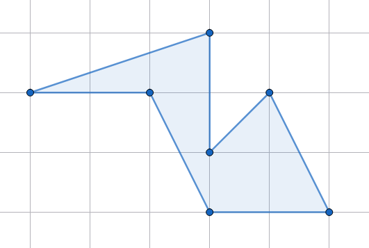
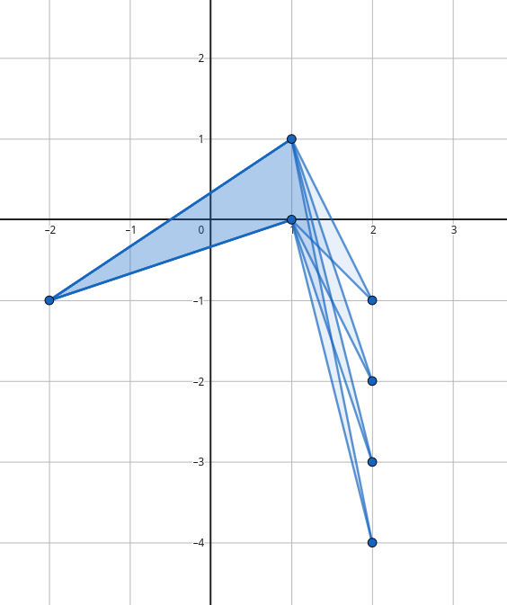

27.04.2026 
Lennart Blumenthal

# Pick's Theorem

Calculate the area of this polygon:

- seems hard by hand at first
- you can do it using geometry code
- using picks theorem you only need to count the number of integer points on the boundary and on the inside

**Pick's Theorem**:
Denote the number of integer points strictly inside the polygon by ``i`` and the number of integer points on the bound by ``b``. The area of the polygon satisfies ``A = i + b/2 - 1``.
(For simple polygons)

## Proof idea
- show for axis aligned triangles
- show that addition & subtraction works
- every shape can be build up from this

## Using Pick's to calculate areas

**Example problem**:
Consider non-degenerated polygons (no self intersections, positive area...), with corners at integer coordinats ``-1'000'000 < x,y < 1'000'000``. Sort all such polygons, which are not convex and strictly contain the point ``(0,0)``, by their area. Output the ``100'000`` the smallest elements. (When multiple have the same area, they are sorted in an arbitrary order).

**Solution**:
Notice that triangles are convex. Thus, ``b>=4`` and as ``(0,0)`` is contained in the polygon ``i>=1``.
By Pick's Theorem, the minimum possible area is ``2``. We can find ``100'000`` of these by for example taking ``{((-2,-1),(1,0),(2,-k),(1,1)) | k natural number}``.

## Using Pick's to find the number of contained points
``A = i + b/2 - 1 <=> i = A - b/2 + 1``

**Example problem**: 
Given a polygon on integer coordinates. Count the number of Points contained in the polygon.

**Solution**:
- Count number of points on the boundary
- calculate area (using geometry code)
- evaluate ``i = A - b/2 + 1``
