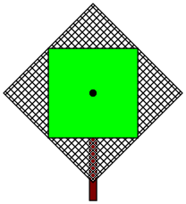
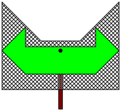
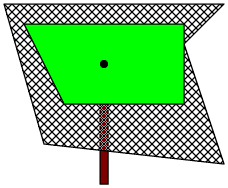
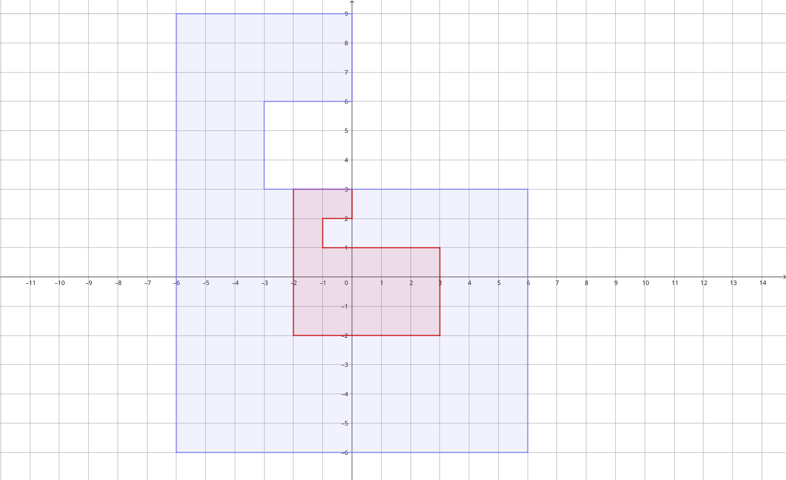
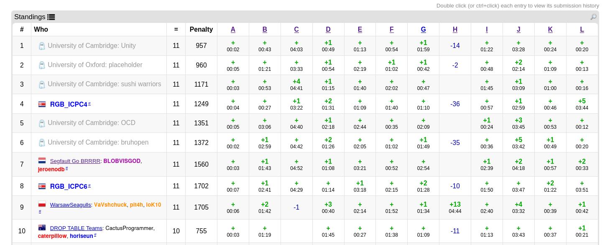
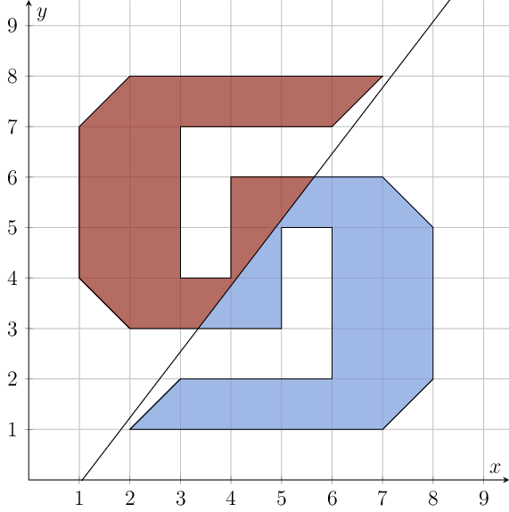

01.06.2026
Lennart Blumenthal
Sebastian G. Kirmayer

# Don't do geometry

## Hedge Topiary (UKIEPC 2024)
https://codeforces.com/gym/105446/problem/H

**Problem**: Given two polygons $P_1$ and $P_2$, which contain $(0,0)$. What is the maximum factor $\lambda$, such that if you scale $P_1$ by a factor of $\lambda$ it is contained in $P_2$?
Output $\lambda$ with absolute or relative precesion of $10^{-6}$.

Seems somwhat doable, right?
You can find different approaches, based on trying different values for $\lambda$:
- binary search  
 $\rightarrow$ not monotone
- iterativeley increasing $\lambda$  
 $\rightarrow$ may end to soon
- iterativeley decreasing $\lambda$  
 $\rightarrow$ may scip possible $\lambda$
 
$\implies$ You have to explicitly calculate intervals of possible values

Note that, there may be some $\lambda$ which is possible but for any small $\epsilon$ both $(\lambda + \epsilon)$ and $(\lambda - \epsilon)$ do not work:

Only works with $\lambda \in \{3\} \cup [0,1]$.

Thus, you have to implement all your intervals with fractions. If you are not carefull with your formulas you will also need bigintegers.

Resulting scoreboard:

No solves in the live contest. At the point of this talk only 4 solutions on codeforces (in almost 2 years).

**(not so) fun fact**: The shortest jury solution is 312 lines of code. 

## Fair Fruitcake Fragmenting
**todo**

## Practice Problems:
(as the title of the talk states, i would not recommend you do these)
- https://codeforces.com/gym/105446/problem/H (UKIEPC 2024)
- https://codeforces.com/gym/105394/problem/F (GCPC 2024)

